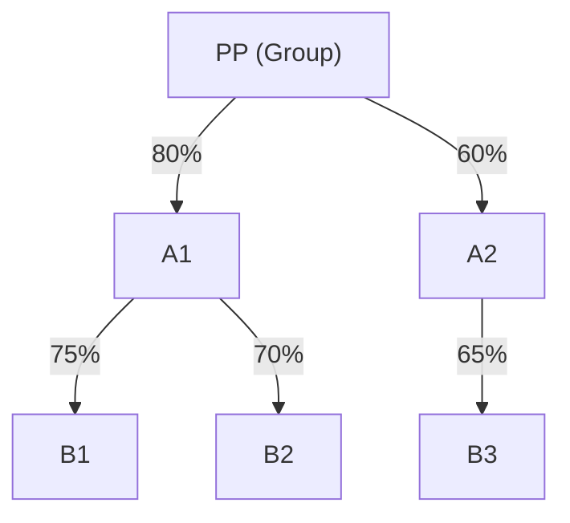
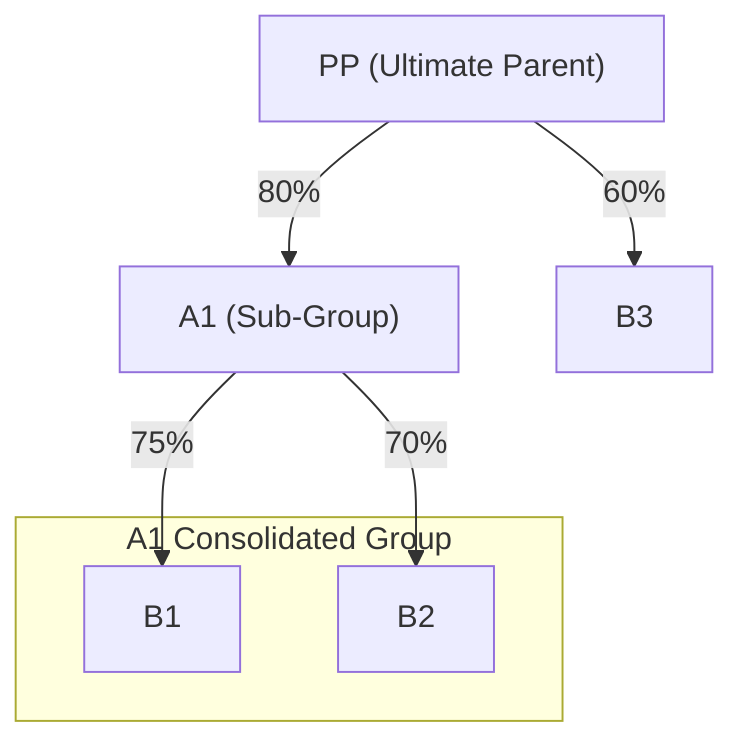
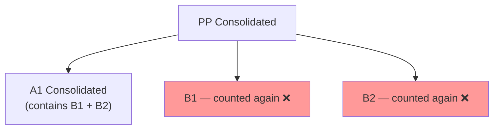
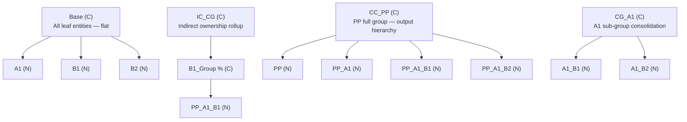
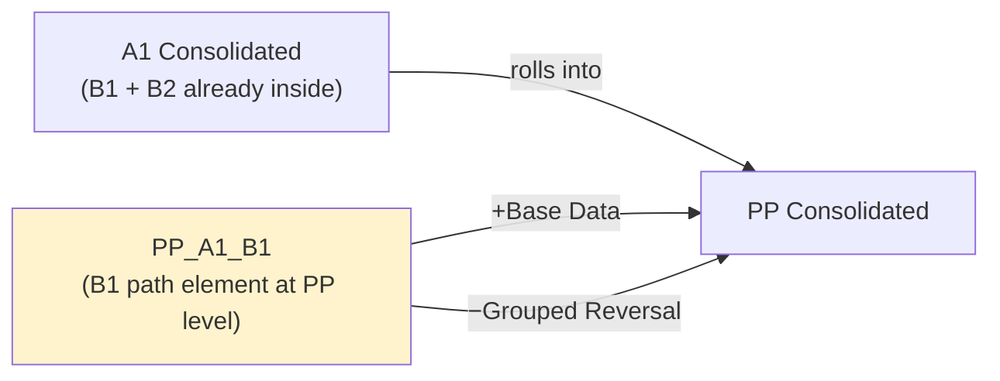

# Financial Consolidation Hierarchy Design in TM1

A conceptual design reference for building a multi-entity, multi-currency financial consolidation hierarchy in IBM Planning Analytics (TM1). This document covers the core design decisions — the ownership graph model, the path encoding mechanism, and the dimension architecture that makes Consolidation of Consolidation (COC) tractable inside a rules-based engine.

> **Prototype status:** An advanced prototype has been built and tested against this design, validating the hierarchy mechanism, COC classification, indirect ownership calculation, and consolidation sequencing across multiple real-world scenarios.

---

## Table of Contents

1. [The Core Problem](#the-core-problem)
2. [Ownership as a Graph](#ownership-as-a-graph)
3. [Classification Thresholds](#classification-thresholds)
4. [Why Consolidation of Consolidation is Hard](#why-consolidation-of-consolidation-is-hard)
5. [The Path Encoding Solution](#the-path-encoding-solution)
6. [Calculating Indirect Ownership from the Name](#calculating-indirect-ownership-from-the-name)
7. [Rules vs TI: Why Live Calculation Wins](#rules-vs-ti-why-live-calculation-wins)
8. [The Dimension Structure](#the-dimension-structure)
9. [The Grouped Override](#the-grouped-override)
10. [Summary: Why This Design Works](#summary-why-this-design-works)
11. [Prototype Validation](#prototype-validation)
12. [Worked Examples and Reference Material](#worked-examples-and-reference-material)

---

## The Core Problem

A consolidated set of accounts must combine the financial results of a group of entities into a single picture — eliminating intragroup transactions, translating currencies, and presenting the group as if it were one company.

The easy case is a flat structure: one parent, several wholly-owned subsidiaries. Every tool handles this.

The hard case is when:

- Ownership is **indirect** — Parent owns an Intermediate which owns a Subsidiary
- Ownership is **partial** — the group owns less than 100%, creating minority interest
- The **same entity belongs to multiple consolidation groups** simultaneously — Consolidation of Consolidation

The first two are well understood and handled by most consolidation tools. The third is where designs fail or become unmaintainable. This document focuses on all three, with particular attention to COC.

---

## Ownership as a Graph

Corporate ownership is a **directed acyclic graph**. Entities are nodes. Ownership relationships are directed edges with a weight — the ownership percentage.



**Effective indirect ownership** is the product of edge weights along the path from the group to the entity:

| Entity | Path | Calculation | Effective Ownership |
|--------|------|-------------|---------------------|
| A1 | PP → A1 | 80% | 80% |
| A2 | PP → A2 | 60% | 60% |
| B1 | PP → A1 → B1 | 80% × 75% | 60% |
| B2 | PP → A1 → B2 | 80% × 70% | 56% |
| B3 | PP → A2 → B3 | 60% × 65% | 39% |

This is edge-weight multiplication on a directed graph — the same mathematics used in supply chain cost propagation, reinsurance exposure chains, and fund-of-funds ownership analysis. The consolidation problem is a well-known graph problem in disguise.

---

## Classification Thresholds

Effective ownership determines how an entity is treated in the consolidated accounts. These thresholds follow IFRS 10 / IAS 28 and reflect the degree of control or significant influence the parent exercises:

| Effective Ownership | Classification | Consolidation Treatment |
|--------------------|----------------|------------------------|
| ≥ 50% | **Subsidiary** | Full line-by-line consolidation |
| > 20% and < 50% | **Associate** | Equity method only |
| > 0% and ≤ 20% | **Investment** | Fair value / cost |

Classification is not static. If a group acquires additional shares and ownership crosses 50%, the entity automatically reclassifies from Associate to Subsidiary — and the consolidation treatment changes with it. The design must handle this dynamically, not as a manual reconfiguration.

---

## Why Consolidation of Consolidation is Hard

COC arises when a subsidiary is itself a consolidating group — it produces its own consolidated accounts, which then roll up into the parent group.



A1 plays two roles simultaneously:
1. A **subsidiary of PP** — its consolidated result rolls into PP's group accounts
2. A **consolidating parent** — it produces its own group accounts containing B1 and B2

### The Double-Count Problem

Without explicit handling, a naive system would:

1. Consolidate B1 and B2 into A1's group accounts ✓
2. Roll A1's consolidated result (already containing B1 and B2) into PP ✓
3. **Also consolidate B1 and B2 directly into PP's group** ✗

B1 and B2 are counted twice. Revenue, assets, and liabilities are overstated. The accounts are wrong — and wrong in a way that passes basic balance checks, making it easy to miss.



### Why This is Architecturally Difficult

The problem is that the same entity (B1) must **behave differently depending on the consolidation context**:

- **In A1's group:** B1 consolidates fully — line-by-line
- **In PP's group:** B1 must NOT consolidate again — it already arrived via A1

A standard hierarchy cannot express this. If B1 is a child of both A1 and PP, it rolls up in both. The hierarchy needs a mechanism to give the same entity independent behaviour in different ownership paths.

---

## The Path Encoding Solution

The key insight: **create a separate dimension element for each ownership path, not just for each entity.**

Instead of a single element `B1`, the dimension contains:

| Element | Meaning | Context |
|---------|---------|---------|
| `B1` | B1 as a base entity | Data storage — the actual trial balance |
| `A1_B1` | B1 as owned by A1 | A1's group consolidation |
| `PP_A1_B1` | B1 as seen by PP via A1 | PP's group — **reversed/grouped to prevent double-count** |

Each element is a unique node in the dimension. Each carries independent consolidation behaviour. The same underlying entity data feeds all of them, but the **treatment** at each level is independently controlled.

### The Naming Convention

Element names encode the full ownership path using fixed-width **2-character entity codes** separated by underscores:

```
PP              2 chars    top-level holding company
PP_A1           5 chars    PP owns A1
PP_A1_B1        8 chars    PP → A1 → B1
PP_A1_B1_C1    11 chars    PP → A1 → B1 → C1
```

Each additional level adds exactly 3 characters (`_XX`). String length encodes depth — deterministically, with no ambiguity:

| String Length | Depth |
|--------------|-------|
| 2 | Root (holding company) |
| 5 | 1 level |
| 8 | 2 levels |
| 11 | 3 levels |
| 14 | 4 levels |

The 2-character codes are **keys, not descriptors**. Human-readable names sit as aliases or attributes on the element — separate from the structural key. This is the same pattern used in any well-designed relational schema: surrogate key + descriptive attribute.

### Extracting Relationships from the Name

Any 2-character pair at a known string position represents a direct parent-child relationship:

```
PP_A1_B1_C1
│  │  │  └── Position 10: C1  (leaf entity)
│  │  └───── Position  7: B1  (C1's direct parent)
│  └──────── Position  4: A1  (B1's direct parent)
└─────────── Position  1: PP  (A1's direct parent)
```

For any element, `SUBST(name, position, 2)` extracts the entity code at that level. **No external lookup is required — the element name is the data structure.** This is the mechanism that makes the entire system work without loops, without recursion, and without graph traversal at query time.

---

## Calculating Indirect Ownership from the Name

Because the element name encodes the full ownership chain, indirect ownership is calculated by extracting each adjacent pair and looking up the direct ownership % for that pair from a time-aware cube:

```
PP_A1_B1
  PP→A1 %  ×  A1→B1 %  =  PP indirect % in B1
  SUBST(1,2)   SUBST(4,2)
  SUBST(4,2)   SUBST(7,2)
```

Three levels:

```
PP_A1_B1_C1
  PP→A1 %  ×  A1→B1 %  ×  B1→C1 %  =  PP indirect % in C1
```

The pattern is consistent: each adjacent pair `(SUBST(pos, 2), SUBST(pos+3, 2))` is one ownership step. The number of multiplications equals the depth, derived from string length.

Direct pairwise ownership percentages are stored in a **separate time-aware cube** keyed on parent code and child code. This means ownership can change month by month without touching the dimension structure — the dimension holds the relationships, the cube holds the weights.

---

## Rules vs TI: Why Live Calculation Wins

Two approaches exist for calculating indirect ownership in a planning engine:

### Option 1 — TI Process (on-demand)

A TI process loops through elements, traverses the chain, multiplies percentages, and writes results to a cube. Straightforward to write. Handles any depth with a loop.

**The problem:** results are only correct at the moment the TI last ran. If ownership crosses 50% — an Associate becoming a Subsidiary — the model applies the wrong consolidation treatment until someone runs the TI. In a live consolidation, that is an unacceptable risk.

### Option 2 — Rules (always live)

Rules fire automatically on any input change. The moment a direct ownership % is updated, every indirect %, classification, and consolidation treatment recalculates across the entire model instantly.

**The constraint:** rules are declarative, not procedural — they cannot loop. Each depth level requires its own rule block:

```
# Depth 1 — PP_A1 (length 5)
Ownership = PP→A1 %

# Depth 2 — PP_A1_B1 (length 8)
Ownership = PP→A1 %  ×  A1→B1 %

# Depth 3 — PP_A1_B1_C1 (length 11)
Ownership = PP→A1 %  ×  A1→B1 %  ×  B1→C1 %
```

Each block is mechanically identical — one more multiplication. String length routes each element to the correct block.

**Why rules win here:** the cost of N fixed blocks is trivial. Real-world group structures rarely exceed 4 levels deep. The consolidation dimension is small — hundreds of entities, not millions. Performance is never a concern. What matters is correctness at all times, without relying on a process being run.

The path encoding turns a graph traversal problem — which requires procedural logic — into a string arithmetic problem, which a declarative rules engine can evaluate natively.

---

## The Dimension Structure

A single dimension holds four distinct hierarchy types simultaneously. Each serves a different purpose in the consolidation workflow:



| Prefix | Hierarchy Type | Purpose |
|--------|---------------|---------|
| *(none)* | **Base** | Flat list of all entities. Every entity appears exactly once. This is where data is loaded |
| `IC_CG` | **Indirect** | Ownership path rollup per entity. Used for ownership reporting and validation |
| `CC_XX` | **COC Root** | Full consolidated group for holding company XX. Contains all path elements. This is the output |
| `CG_XX` | **Sub-Group** | Consolidation group for intermediate entity XX. Contains entities owned directly by XX |

The same entity (e.g., B1) appears multiple times — once in Base as a data node, once in IC_CG for ownership reporting, and once per consolidation path in the CC_ and CG_ hierarchies. Each appearance is a distinct dimension element with independent behaviour.

### Preventing the Double-Count

Path elements in the parent group that are already captured in a sub-group consolidation are flagged as **Grouped**. A rule fires a reversal equal to their base data — net contribution becomes zero. Those entities reach the parent group only via the sub-group's consolidated result.



Net effect: `+Base Data − Grouped Reversal = 0`. B1 is counted exactly once.

---

## The Grouped Override

Not all COC situations fall neatly from ownership percentage. Group structure decisions — regulatory requirements, legal constraints, presentational choices — sometimes require a specific treatment regardless of the calculated ownership.

Four overrides are supported, each taking precedence over the calculated classification:

| Override | Treatment Applied |
|----------|------------------|
| **Y — Grouped** | Base data reversed. Entity excluded from direct consolidation — arrives only via sub-group |
| **S — Subsidiary** | Force full consolidation regardless of calculated % |
| **A — Associate** | Force equity method regardless of calculated % |
| **I — Investment** | Force investment treatment regardless of calculated % |

Overrides are stored in a **time-aware cube** — they can be applied for a specific period and version without changing any other period. This is important for restating comparative periods when group structure decisions change retrospectively.

---

## Summary: Why This Design Works

| Problem | Solution |
|---------|----------|
| Same entity in multiple groups | Separate path element per ownership path |
| Double-count in COC | Grouped flag + automatic reversal rule |
| Indirect ownership calculation | String position arithmetic on element name — no external lookup, no recursion |
| Live recalculation on ownership change | Rules, not TI — one deterministic block per depth level |
| Time-varying ownership % | Stored in a period-aware cube, not in the dimension |
| Entity history preserved on disposal | Elements never deleted — removed from active consolidation group only |
| Ownership crossing a threshold | Classification recalculates automatically — no manual intervention |

The design separates three concerns that are often conflated:

1. **Identity** — what the entity is (`B1` as a base element, with name and currency as attributes)
2. **Relationship** — how entities connect (`PP_A1_B1` encodes the full ownership path)
3. **Ownership %** — how much is owned (stored in a time-aware cube, keyed on 2-char codes)

Each concern changes at a different frequency and for different reasons. Keeping them separate makes the model maintainable, auditable, and correct across time.

The deeper insight is that the naming convention converts a **graph traversal problem** — which requires procedural logic and is hard to express in a declarative rules engine — into a **string arithmetic problem**, which any rules engine can evaluate natively and instantly. That is the invention at the heart of this design.

---

## Prototype Validation

The design has been implemented and tested as an advanced prototype in IBM Planning Analytics (TM1). Scenarios validated include:

- **Direct consolidation** — single-level hierarchy, full and partial ownership
- **Multi-level indirect consolidation** — chain traversal and indirect % calculation across levels
- **Consolidation of Consolidation** — sub-group entities correctly excluded from parent double-count via Grouped reversal
- **Ownership threshold crossing** — automatic reclassification between Subsidiary / Associate / Investment on ownership change
- **Override classification** — manual Grouped, Investment, Associate, Subsidiary overrides applied per period
- **Multi-currency** — local currency entity data translated to group currency with account-level rate type mapping

---

## Worked Examples and Reference Material

*Reference material and worked journal examples used in prototype testing to be added here.*
